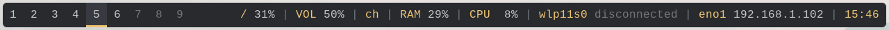

<<<<<<< HEAD
# polybar-dwm-module


**polybar-dwm-module** is a fork of
[polybar](https://github.com/polybar/polybar) which implements a dwm module.

=======
<p align="center">
  
  
</p>

<p align="center">
A fast and easy-to-use tool for creating status bars.
</p>

<p align="center">
<a href="https://github.com/polybar/polybar/releases"></a>
<a href="https://github.com/polybar/polybar/releases"></a>
<a href="https://github.com/polybar/polybar/actions?query=workflow%3ACI"></a>
<a href="https://github.com/polybar/polybar/actions?query=workflow%3A%22Release+Workflow%22"></a>
<a href="https://polybar.readthedocs.io"></a>
<a href="https://gitter.im/polybar/polybar"></a>
<a href="https://codecov.io/gh/polybar/polybar/branch/master"></a>
<a href="https://github.com/polybar/polybar/blob/master/LICENSE"></a>
<a href="https://www.codetriage.com/polybar/polybar"></a>
<a href="https://opencollective.com/polybar"></a>
</p>

**[Documentation](https://github.com/polybar/polybar/wiki/) | [Installation](#installation) | [Support](SUPPORT.md) | [Donate](#donations)**

**Polybar** aims to help users build beautiful and highly customizable status bars
for their desktop environment, without the need of having a black belt in shell scripting.



## Table of Contents

* [Introduction](#introduction)
* [Getting Help](#getting-help)
* [Contributing](#contributing)
* [Getting started](#getting-started)
  * [Installation](#installation)
  * [First Steps](#first-steps)
* [Community](#community)
* [Contributors](#contributors)
* [Donations](#donations)
  * [Sponsors](#sponsors)
  * [Backers](#backers)
* [License](#license)
* [Signatures](#signatures)
>>>>>>> 1ee11f7c9e72719f62981167a24fe7239774fa69

## Requirements
* dwm with the [IPC patch](https://github.com/mihirlad55/dwm-ipc) applied
* [dwmipcpp](https://github.com/mihirlad55/dwmipcpp) C++ client library for
  communicating with dwm (included as a submodule).
* [jsoncpp](https://github.com/open-source-parsers/jsoncpp) for polybar and
  dwmipcpp (required by module).

<<<<<<< HEAD
The [dwm-anybar patch](https://github.com/mihirlad55/dwm-anybar) is optionally
recommended for a better experience. This patch allows dwm to manage polybar and
fixes some weird quirks that you may experience without it.
=======
The main purpose of **Polybar** is to help users create awesome status bars.
It has built-in functionality to display information about the most commonly used services.
Some of the services included so far:

- Systray icons
- Window title
- Playback controls and status display for [MPD](https://www.musicpd.org/) using [libmpdclient](https://www.musicpd.org/libs/libmpdclient/)
- [ALSA](https://www.alsa-project.org/main/index.php/Main_Page) and [PulseAudio](https://www.freedesktop.org/wiki/Software/PulseAudio/) volume controls
- Workspace and desktop panel for [bspwm](https://github.com/baskerville/bspwm) and [i3](https://github.com/i3/i3)
- Workspace module for [EWMH compliant](https://specifications.freedesktop.org/wm-spec/wm-spec-1.3.html#idm140130320786080) window managers
- Keyboard layout and indicator status
- CPU and memory load indicator
- Battery display
- Network connection details
- Backlight level
- Date and time label
- Time-based shell script execution
- Command output tailing
- User-defined menu tree
- Inter-process messaging
- And more...

[See the wiki for more details](https://github.com/polybar/polybar/wiki).

## Getting Help

If you find yourself stuck, have a look at our [Support](SUPPORT.md) page for resources where you can find help.

## Contributing

Read our [contributing guidelines](CONTRIBUTING.md) for how to get started with contributing to polybar.

## Getting started

### Installation

<a href="https://repology.org/metapackage/polybar">
    
</a>

Polybar is already available in the package manager for many repositories.
We list some of the more prominent ones here.
Also click the [image on the
right](https://repology.org/project/polybar/versions) to see a more complete
list of available polybar packages.

If you are using **Debian** (bullseye/11/stable) or later, you can install [polybar](https://tracker.debian.org/pkg/polybar)
using `sudo apt install polybar`. Newer releases of polybar are sometimes provided in the [backports](https://wiki.debian.org/Backports)
repository for stable users, you need to enable [backports](https://wiki.debian.org/Backports) and then install using
`sudo apt -t buster-backports install polybar`.

If you are using **Ubuntu** 20.10 (Groovy Gorilla) or later, you can install polybar
using `sudo apt install polybar`.

If you are using **Arch Linux**, you can install
[polybar](https://archlinux.org/packages/community/x86_64/polybar/) to get the
latest stable release using `sudo pacman -S polybar`. The latest unstable
changes are also available in the
[`polybar-git`](https://aur.archlinux.org/packages/polybar-git) package in the
AUR.

If you are using **Manjaro**, you can install [polybar](https://software.manjaro.org/package/polybar) to get the latest stable release using `sudo pacman -S polybar`.

If you are using **Void Linux**, you can install [polybar](https://github.com/void-linux/void-packages/blob/master/srcpkgs/polybar/template) using `xbps-install -S polybar`.

If you are using **NixOS**, polybar is available in both the stable and unstable channels and can be installed with the command `nix-env -iA nixos.polybar`.

If you are using **Slackware**, polybar is available from the [SlackBuilds](https://slackbuilds.org/repository/14.2/desktop/polybar/) repository.

If you are using **Source Mage GNU/Linux**, polybar spell is available in test grimoire and can be installed via `cast polybar`.

If you are using **openSUSE Tumbleweed**, polybar is available from the
[official
repositories](https://build.opensuse.org/package/show/openSUSE%3AFactory/polybar)
and can be installed via `zypper install polybar`.

If you are using **openSUSE Leap**, polybar is available from
[OBS](https://build.opensuse.org/package/show/X11:Utilities/polybar/).
The package is available for openSUSE Leap 15.1 and above.

If you are using **FreeBSD**, [polybar](https://svnweb.freebsd.org/ports/head/x11/polybar/) can be installed using `pkg install polybar`. Make sure you are using the `latest` package branch.

If you are using **Gentoo**, both release and git-master versions are available in the [main](https://packages.gentoo.org/packages/x11-misc/polybar) repository.

If you are using **Fedora**, you can install [polybar](https://src.fedoraproject.org/rpms/polybar) using `sudo dnf install polybar`.

If you can't find your distro here, you will have to [build from source](https://github.com/polybar/polybar/wiki/Compiling).

### First Steps
[See the wiki for details on how to run and configure polybar](https://github.com/polybar/polybar/wiki).

## Community
Want to get in touch?

* Visit our [Discussion page](https://github.com/polybar/polybar/discussions)
* Join our Gitter room at [`gitter.im/polybar/polybar`](https://gitter.im/polybar/polybar)
* We have our own subreddit at [`r/polybar`](https://www.reddit.com/r/polybar)
* Chat with us in the `#polybar` IRC channel on the [`irc.libera.chat:6697`](https://libera.chat/) server

## Contributors

### Maintainers
* Patrick Ziegler [**@patrick96**](https://github.com/patrick96)

### Owner
* Michael Carlberg [**@jaagr**](https://github.com/jaagr/)

### Former Maintainers
* [**@Lomadriel**](https://github.com/Lomadriel)
* [**@NBonaparte**](https://github.com/NBonaparte)
* Chase Geigle [**@skystrife**](https://github.com/skystrife)

### Logo Design by
* [**@Tobaloidee**](https://github.com/Tobaloidee)
>>>>>>> 1ee11f7c9e72719f62981167a24fe7239774fa69


## The DWM Module
The dwm module currently supports the following:
- Labels:
    * Display dwm tags
        - Separator label between tags
    * Display the current layout
    * Display the currently focused window title (per monitor)
    * Display label when focused window is floating
- Click Handlers:
    * Tags:
        - Left-click tag to view tag
        - Right-click tag to toggle view on tag
        - Scroll tags to view different tags (with wrapping, reverse scroll, and
          empty tag scroll)
    * Layout:
        - Left-click to set `secondary-layout` (specified in config)
        - Right-click to set previous layout
        - Scroll to cycle through layouts (with wrapping and reverse scroll)
- Different formatting for different tag states:
    * Focused: selected tag on selected monitor
    * Unfocused: selected tag on unselected monitor
    * Visible: unselected, but occupied tag on any monitor
    * Urgent: Tag with window that has the urgent hint set
    * Empty: Unselected and unoccupied tags
- The combined power of polybar


## How to Install
First, apply all the patches you want on dwm, saving the IPC patch for last.

Optionally, apply the [dwm-anybar
patch](https://github.com/mihirlad55/dwm-anybar) and make sure your `config.h`
contains the following
```
static const int showbar            = 1;        /* 0 means no bar */
static const int topbar             = 1;        /* 0 means bottom bar */
static const int usealtbar          = 1;        /* 1 means use non-dwm status bar */
static const char *altbarclass = "Polybar";     /* Alternate bar class name */
static const char *altbarcmd  = "$HOME/bar.sh"; /* Alternate bar launch command */
```
If your polybar is to be displayed on the bottom of the monitor, set `topbar`
to `0`.

Next, apply the [IPC patch](https://github.com/mihirlad55/dwm-ipc). There will
likely be merge conflicts. The IPC patch is mostly additive, so in most conflict
cases, you will be keeping both changes.

After applying all your patches, make sure you compile and install dwm
```
$ sudo make install
```

Make sure you have `jsoncpp` installed, and any other requirements from
[polybar](https://github.com/polybar/polybar).

Arch linux users can install the
[`polybar-dwm-module`](https://aur.archlinux.org/packages/polybar-dwm-module/)
package from the AUR.

Otherwise you can clone, make, and install polybar yourself. Follow the on
screen prompts in the `build.sh` script and enable any additional features you
want.
```
$ git clone https://github.com/mihirlad55/polybar-dwm-module
$ cd polybar-dwm-module
$ ./build.sh -d
```

Configure the bar!  You can view `/usr/share/doc/polybar/config` for a sample config that
includes the supported settings for the dwm module.

**IF YOU APPLIED THE ANYBAR PATCH**, make sure you have
`override-redirect = false` in your polybar config.

**IF YOU DID NOT APPLY THE ANYBAR PATCH**, make sure you have
`override-redirect = true` in your polybar config. You will have to set the bar
height in your dwm's `config.h` to match polybar's height and make sure
`showbar` is set to `1` in your `config.h`. Also make sure `topbar` is set to
the correct value based on if your polybar is a bottom/top bar.

## Launching Polybar
There are multiple ways to launch polybar. Whatever way you decide to use, make
sure polybar launches a few seconds after dwm, else dwm's socket will not be
initialized and the module will fail:

### Anybar Method
The `altbarcmd` variable can be set to the bar launch script. When you apply the
anybar patch, make sure `spawnbar()` occurs in the `setup()` function after
`setupepoll()` and this will ensure that the bar is launched after dwm is ready.
Also make sure that the script checks for running bars before launching more,
else if dwm is restarted, duplicate bars will be launched.

### Hacky Delay Method
In your `.xsession` script or whatever script launches at startup, add something
like the following:
```
$(sleep 4s && "$HOME/launch-polybar.sh") &
```
This will start your polybar script after a 4 second delay which should give dwm
enough time to initialize before polybar tries to connect to dwm. If this
doesn't work, try a longer delay.

### Autostart Method
Apply the [autostart patch](https://dwm.suckless.org/patches/autostart/). In
your `autostart_blocking.sh`, add your command to launch polybar.


## Sample Module Configuration
```ini
...

modules-left = ... dwm ...

...

[module/dwm]
type = internal/dwm
format = <label-tags> <label-layout> <label-floating> <label-title>
; Path to dwm socket (default: /tmp/dwm.sock)
; socket-path = /tmp/dwm.sock

; Left-click to view tag, right-click to toggle tag view
enable-tags-click = false
; Scroll to cycle between available tags
enable-tags-scroll = false
; If true and enable-tags-scroll = true, scrolling will view all tags regardless if occupied
tags-scroll-empty = false
; If true and enable-tags-scroll = true, scrolling will cycle through tags backwards
tags-scroll-reverse = false
; If true and enable-tags-scroll = true, wrap active tag when scrolling
tags-scroll-wrap = false
; Left-click to set secondary layout, right-click to switch to previous layout
enable-layout-click = false
; Scroll to cycle between available layouts
enable-layout-scroll = false
; Wrap when scrolling and reaching beginning/end of layouts
layout-scroll-wrap = false
; Reverse scroll direction
layout-scroll-reverse = false

; If enable-layout-click = true, clicking the layout symbol will switch to this layout
secondary-layout-symbol = [M]

; Separator in between shown tags
; label-separator = |

; Title of currently focused window
; Available tokens:
;   %title%
label-title = %title%
label-title-padding = 2
label-title-foreground = ${colors.primary}
label-title-maxlen = 30

; Defaults to 'Desktop'
label-title-default = "Desktop"

; Symbol of current layout
; Available tokens:
;   %symbol%
label-layout = %symbol%
label-layout-padding = 2
label-layout-foreground = #000
label-layout-background = ${colors.primary}

; Text to show when currently focused window is floating
label-floating = F

; States: focused, unfocused, visible, urgent, empty
; Available tokens:
;   %name%

; focused = Selected tag on focused monitor
label-focused = %name%
label-focused-background = ${colors.background-alt}
label-focused-underline= ${colors.primary}
label-focused-padding = 2

; unfocused = Unselected tag on unselected monitor
label-unfocused = %name%
label-unfocused-padding = 2

; visible = Unselected tag, but occupied tag on any monitor
label-visible = %name%
label-visible-background = ${self.label-focused-background}
label-visible-underline = ${self.label-focused-underline}
label-visible-padding = ${self.label-focused-padding}

; urgent = Unselected tag with window that has urgency hint set
label-urgent = %name%
label-urgent-background = ${colors.alert}
label-urgent-padding = 2

; empty = Unselected and unoccupied tag
; This can be set to an empty string to hide empty tags
label-empty = %name%
label-empty-background = ${colors.primary}
label-empty-padding = 2
```

You can also take a look at my
[personal](https://github.com/mihirlad55/dotfiles/blob/arch-dwm/.config/polybar/config#L99)
bar configuration which is more representative of the screenshot above.


## Donations

Polybar accepts donations through [open collective](https://opencollective.com/polybar).

[Become a backer](https://opencollective.com/polybar) and support polybar!
### Sponsors

<a href="https://opencollective.com/polybar/sponsor/0/website?requireActive=false" target="_blank"></a>
<a href="https://opencollective.com/polybar/sponsor/1/website?requireActive=false" target="_blank"></a>
<a href="https://opencollective.com/polybar/sponsor/2/website?requireActive=false" target="_blank"></a>
<a href="https://opencollective.com/polybar/sponsor/3/website?requireActive=false" target="_blank"></a>
<a href="https://opencollective.com/polybar/sponsor/4/website?requireActive=false" target="_blank"></a>
<a href="https://opencollective.com/polybar/sponsor/5/website?requireActive=false" target="_blank"></a>
<a href="https://opencollective.com/polybar/sponsor/6/website?requireActive=false" target="_blank"></a>
<a href="https://opencollective.com/polybar/sponsor/7/website?requireActive=false" target="_blank"></a>
<a href="https://opencollective.com/polybar/sponsor/8/website?requireActive=false" target="_blank"></a>
<a href="https://opencollective.com/polybar/sponsor/9/website?requireActive=false" target="_blank"></a>
<a href="https://opencollective.com/polybar/sponsor/10/website?requireActive=false" target="_blank"></a>
<a href="https://opencollective.com/polybar/sponsor/11/website?requireActive=false" target="_blank"></a>
<a href="https://opencollective.com/polybar/sponsor/12/website?requireActive=false" target="_blank"></a>
<a href="https://opencollective.com/polybar/sponsor/13/website?requireActive=false" target="_blank"></a>
<a href="https://opencollective.com/polybar/sponsor/14/website?requireActive=false" target="_blank"></a>
<a href="https://opencollective.com/polybar/sponsor/15/website?requireActive=false" target="_blank"></a>
<a href="https://opencollective.com/polybar/sponsor/16/website?requireActive=false" target="_blank"></a>
<a href="https://opencollective.com/polybar/sponsor/17/website?requireActive=false" target="_blank"></a>
<a href="https://opencollective.com/polybar/sponsor/18/website?requireActive=false" target="_blank"></a>
<a href="https://opencollective.com/polybar/sponsor/19/website?requireActive=false" target="_blank"></a>
<a href="https://opencollective.com/polybar/sponsor/20/website?requireActive=false" target="_blank"></a>
<a href="https://opencollective.com/polybar/sponsor/21/website?requireActive=false" target="_blank"></a>
<a href="https://opencollective.com/polybar/sponsor/22/website?requireActive=false" target="_blank"></a>
<a href="https://opencollective.com/polybar/sponsor/23/website?requireActive=false" target="_blank"></a>
<a href="https://opencollective.com/polybar/sponsor/24/website?requireActive=false" target="_blank"></a>
<a href="https://opencollective.com/polybar/sponsor/25/website?requireActive=false" target="_blank"></a>
<a href="https://opencollective.com/polybar/sponsor/26/website?requireActive=false" target="_blank"></a>
<a href="https://opencollective.com/polybar/sponsor/27/website?requireActive=false" target="_blank"></a>
<a href="https://opencollective.com/polybar/sponsor/28/website?requireActive=false" target="_blank"></a>
<a href="https://opencollective.com/polybar/sponsor/29/website?requireActive=false" target="_blank"></a>

### Backers

<a href="https://opencollective.com/polybar/backer/0/website?requireActive=false" target="_blank"></a>
<a href="https://opencollective.com/polybar/backer/1/website?requireActive=false" target="_blank"></a>
<a href="https://opencollective.com/polybar/backer/2/website?requireActive=false" target="_blank"></a>
<a href="https://opencollective.com/polybar/backer/3/website?requireActive=false" target="_blank"></a>
<a href="https://opencollective.com/polybar/backer/4/website?requireActive=false" target="_blank"></a>
<a href="https://opencollective.com/polybar/backer/5/website?requireActive=false" target="_blank"></a>
<a href="https://opencollective.com/polybar/backer/6/website?requireActive=false" target="_blank"></a>
<a href="https://opencollective.com/polybar/backer/7/website?requireActive=false" target="_blank"></a>
<a href="https://opencollective.com/polybar/backer/8/website?requireActive=false" target="_blank"></a>
<a href="https://opencollective.com/polybar/backer/9/website?requireActive=false" target="_blank"></a>
<a href="https://opencollective.com/polybar/backer/10/website?requireActive=false" target="_blank"></a>
<a href="https://opencollective.com/polybar/backer/11/website?requireActive=false" target="_blank"></a>
<a href="https://opencollective.com/polybar/backer/12/website?requireActive=false" target="_blank"></a>
<a href="https://opencollective.com/polybar/backer/13/website?requireActive=false" target="_blank"></a>
<a href="https://opencollective.com/polybar/backer/14/website?requireActive=false" target="_blank"></a>
<a href="https://opencollective.com/polybar/backer/15/website?requireActive=false" target="_blank"></a>
<a href="https://opencollective.com/polybar/backer/16/website?requireActive=false" target="_blank"></a>
<a href="https://opencollective.com/polybar/backer/17/website?requireActive=false" target="_blank"></a>
<a href="https://opencollective.com/polybar/backer/18/website?requireActive=false" target="_blank"></a>
<a href="https://opencollective.com/polybar/backer/19/website?requireActive=false" target="_blank"></a>
<a href="https://opencollective.com/polybar/backer/20/website?requireActive=false" target="_blank"></a>
<a href="https://opencollective.com/polybar/backer/21/website?requireActive=false" target="_blank"></a>
<a href="https://opencollective.com/polybar/backer/22/website?requireActive=false" target="_blank"></a>
<a href="https://opencollective.com/polybar/backer/23/website?requireActive=false" target="_blank"></a>
<a href="https://opencollective.com/polybar/backer/24/website?requireActive=false" target="_blank"></a>
<a href="https://opencollective.com/polybar/backer/25/website?requireActive=false" target="_blank"></a>
<a href="https://opencollective.com/polybar/backer/26/website?requireActive=false" target="_blank"></a>
<a href="https://opencollective.com/polybar/backer/27/website?requireActive=false" target="_blank"></a>
<a href="https://opencollective.com/polybar/backer/28/website?requireActive=false" target="_blank"></a>
<a href="https://opencollective.com/polybar/backer/29/website?requireActive=false" target="_blank"></a>

## License
<<<<<<< HEAD
Polybar is licensed under the MIT license. [See LICENSE for more
information](https://github.com/polybar/polybar/blob/master/LICENSE).
=======

Polybar is licensed under the MIT license. [See LICENSE for more information](https://github.com/polybar/polybar/blob/master/LICENSE).

## Signatures

Release archives and tags are signed by a maintainer using GPG. Currently
everything is signed by [Patrick Ziegler](https://www.patrickziegler.ch/gpg)
with fingerprint `1D5791352D51A228D4DDDBA4521E5E03AEBCA1A7`
>>>>>>> 1ee11f7c9e72719f62981167a24fe7239774fa69
